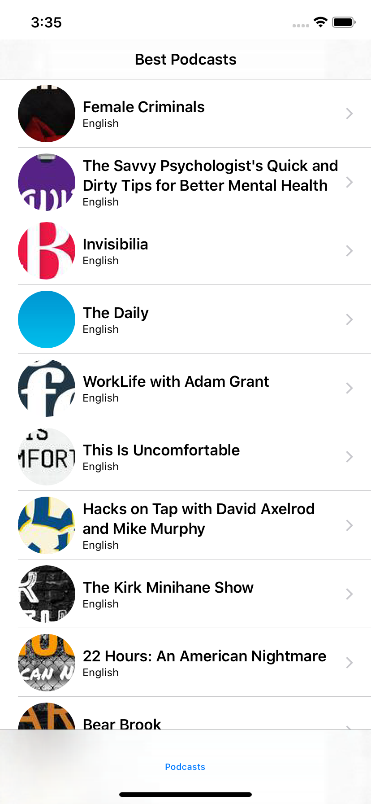
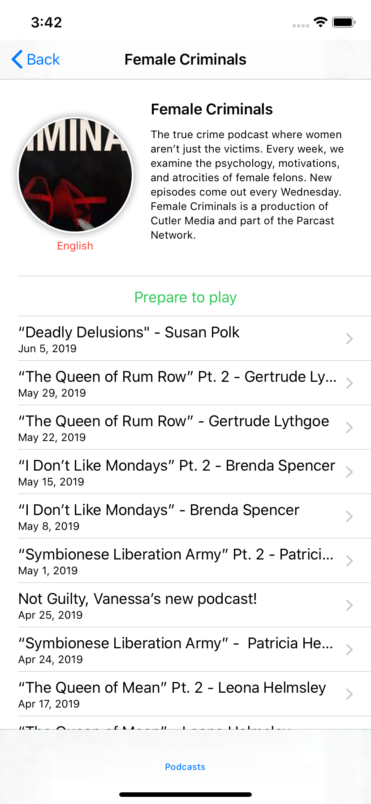
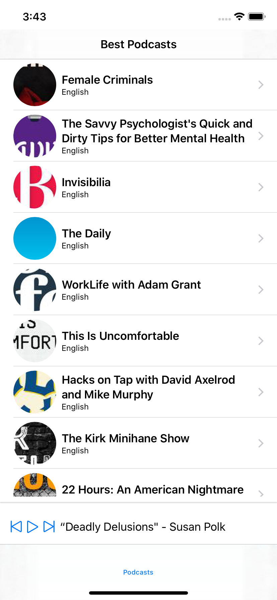

# Podcasts
Simple app to show usage of SwiftUI and Combine. The app shows a list of podcasts fetched from [listennotes](https://www.listennotes.com/api/) and it can be played. 

Status: Work in progress.

TODO'S:

    * Wrap Image Loader to avoid reload the entire view
    * Migrate all the views to have enum states
    * Try environment object
    * Check cancelations
  
Warning: SwiftUI and Combine are in beta now.
